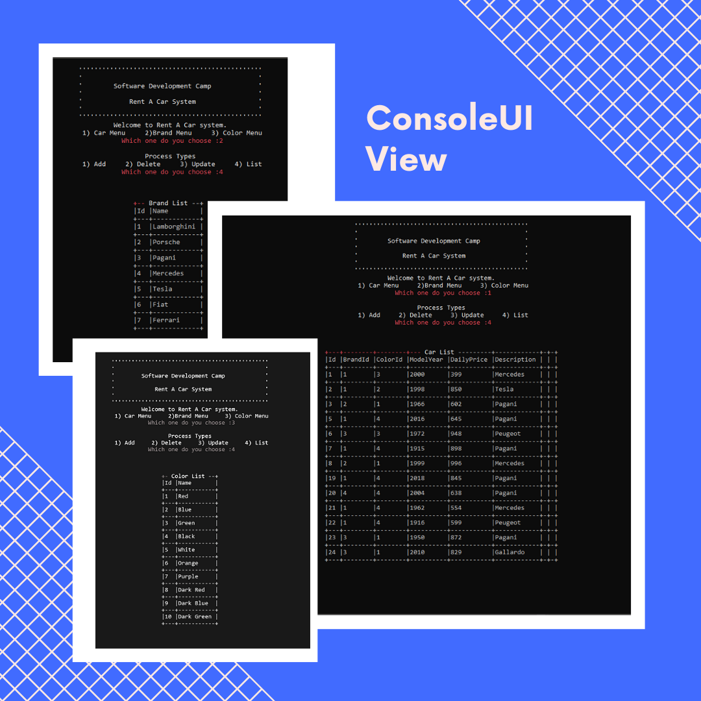

# Araç Kiralama Sistemi


<b>Herkese merhaba!</b>  <p>Bu repo Yazılım Geliştirici Yetiştirme Kampı'nda yapılan çalışmaları kapsayan Araç Kiralama Projesidir. Genel olarak proje katmanlı mimariye uygun şekilde tasarlandı</p>
<p>Dikkat Profesyonel Teknikler İçerir..</p>
<br>

Öncelikle terminale gelin ve aşağıdaki komutları girin :

```bash
# Repository klonlayın
$ git clone https://github.com/Kontorta16/RentACar.git

# Klonladığınız klasöre gidin
$ cd RentACar.git

# Bağımlılıkları yükleyin
$ dotnet restore
```
## Ekran Görüntüleri
<br>
<p align="center">
	</img>
</p>
<br>

## Technologies Used 

- [Entity Framework](https://reactjs.org/)
- [FluentValidation](https://www.apollographql.com/docs/react/get-started/)
- [ConsoleTableExt](https://github.com/minhhungit/ConsoleTableExt)
- [Autofac](https://github.com/minhhungit/ConsoleTableExt)

## Software Engineer - Web Development
#### Emircan Dalman
🧧 [Medium](https://medium.com/@Kontorta)

💻 [Linkedin](https://www.linkedin.com/in/kontorta/)

💬 [Discord](Kontorta#8800)

🎫 [Email](mailto:emircandalman28@gmail.com)
